# cryptanalib3

`cryptanalib3` is a Python3 fork of the `cryptanalib` module from the FeatherDuster project, meant to be a standalone module for performing cryptanalysis and cryptographic exploit development.

Since Python3 forces a choice between bytes and string objects, cryptanalib3 now operates entirely on bytes objects in order to avoid the various ways in which Python manipulates strings to try to ensure the data is readable in the user's locale. All functions that consumed and return strings in the original Cryptanalib now receive and return bytes objects.

## Usage

To use `cryptanalib3`, launch Python3 and `import ca3`. Since Python's built-in `help()` doesn't do a very good job of showing function prototypes with complex default values, there is a `show_help()` function provided that addresses this shortcoming and functions more or less identically to the built-in `help()`. You can use this function to explore the functions provided by the module, like so:

Cryptanalib3 can attempt to decode, identify, and look for indicators of vulnerability with the `analyze_ciphertext()` function:

Here is an example of generating ciphertext from a script that will give us a flag encrypted with AES-CTR using a fixed nonce, as well as encrypting any value we like using the fixed nonce. We first use the `analyze_ciphertext()` function to determine that the ciphertext is generated with a stream cipher, and that there are signs that the key may be reused, indicated by the `key_reuse` keyword returned by the analysis. This means we can launch a known plaintext attack against the ciphertext, calculating the keystream by XORing together any corresponding known plaintext and ciphertext. We encrypt a long string of `aaaa...`, then XOR it with its encrypted version. We then XOR the keystream with the encrypted flag, decrypting it:

